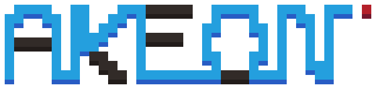

 
Short for "snake online", akeon is a fully-customizable, online CLI version of snake made with ncurses. 
Type `akeon --help` for all the customization and game options.

## TODO
- [ ] Add "YOU LOST" message (with exit option)
- [ ] Add online multiplayer
- [ ] Header files do correctly (split .h and .c)
- [ ] Fix grid spawn
- [ ] Add menu
- [ ] Face-to-face collision either kills both or snakes bounce to another direction
- [ ] UI & Messages
- [ ] Diagonal movement
- [ ] Choose server's fixedsize or min fixedsize
- [ ] Convert all coordinates to xy
- [ ] Win when alive_players == 1 or when snake.length == MAX_LENGTH

### Gamemodes
- [ ] Corpses (bodies stay as trash)
- [ ] Dedicated (apples can be only used by their respective player, others die)
- [ ] Split mode (snakes hit w/head get split)
- [ ] Trash (random trash generated)
- [ ] Steal (steal killed snake's size)
- [ ] Speed (double forward uses 1 size for boost)
